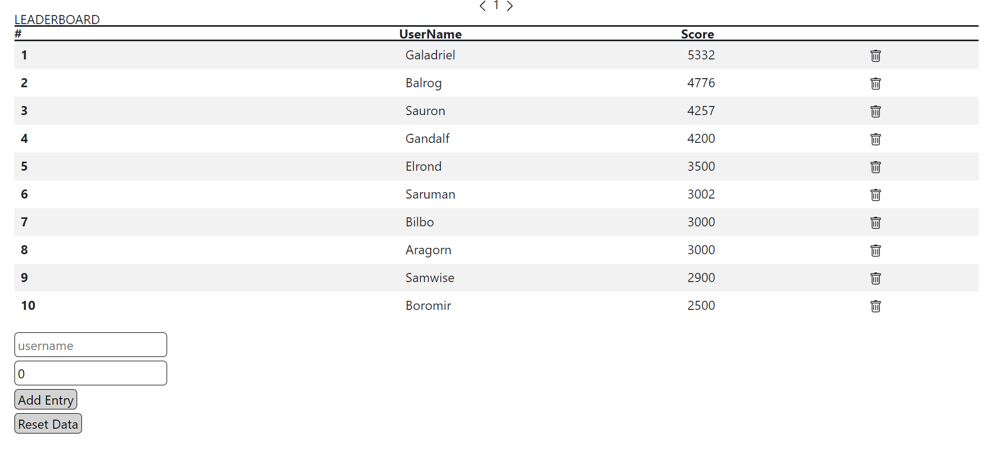

# redis-leaderboard

## What it is

Redis-leaderboard is a web application that displays an artificial leaderboard 
containing usernames and scores. The leaderboard entries are sorted based on 
the scores in descending order. The leaderboard data fetching API uses a blazing-
fast cache system known as Redis, while the website itself is hosted as a 
DotNet 6 Blazor Server application. 



## How it Works

Upon initial startup, the Redis cache is populated from a Json file containing 
leaderboard entries. The API then fetches the data contained inside of the cache
and displays it in a table format within the web browser. Users can add leaderboard
entries, which pushes the new information into the cache. Users can also delete
entries from the leaderboard which remove that information from the cache. 

The leaderboard data will persist as long as the page is not re-initialized. The
 user does have the option to 'reset' the 
data using the 'Reset Data' button. This action will remove all data from the 
"leaderboard" cache and re-load the starting Json data into it. 

## Getting Started

### Windows

Install [DotNet 6](https://dotnet.microsoft.com/en-us/download)

Install [Docker](https://www.docker.com/products/docker-desktop)

Clone repo to local machine: 

```
git clone https://github.com/AndrewCS149/redis-leaderboard.git
```

Run the official Docker Redis image: 

```
docker run --name [database name] -p 5002:6379 -d redis
```

From the project root, run the project:

```
dotnet run --project .\RedisLeaderboard\RedisLeaderboard\RedisLeaderboard.csproj
```

Navigate to the listening port in your web browser:

```
Now listening on: https://localhost:[port]
```